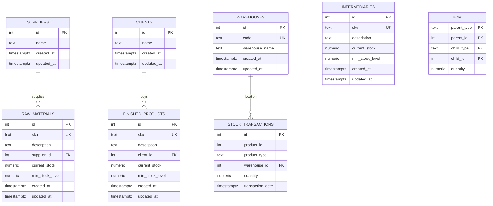
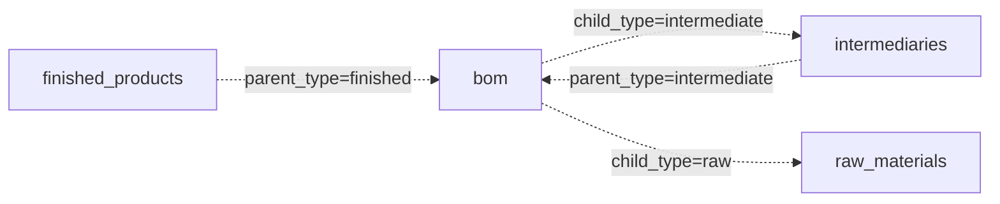
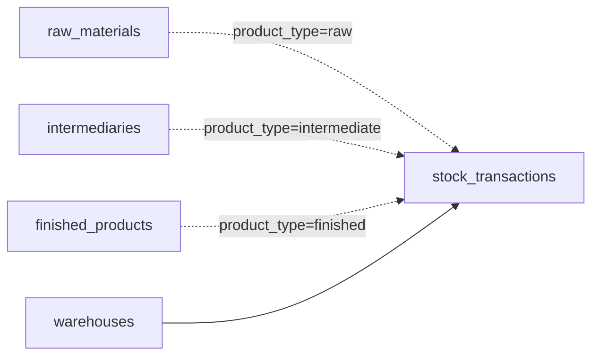

# Entity Relationship Diagram

The diagram below reflects the current migrated schema.

## Typed relationships

Two important relationships cannot be expressed as ordinary SQL foreign keys
because the destination table depends on a type column.

### BOM

The database enforces those references through `trg_check_bom_references`.

### Stock transactions

The typed product reference is checked by `trg_check_stock_before_insert`.

## Physical vs logical relationships

The solid relationships in the ER diagram correspond to physical foreign keys:

- `raw_materials.supplier_id -> suppliers.id`
- `finished_products.client_id -> clients.id`
- `stock_transactions.warehouse_id -> warehouses.id`

The BOM and stock-product links are logical typed relationships and are
validated by database functions and triggers.

For column-level details, see the [Schema Reference](SCHEMA.md).

The older editable draw.io source remains available as
[`ERD.drawio`](ERD.drawio), but the Mermaid diagram above is the preferred
version-controlled source for the documentation site.
