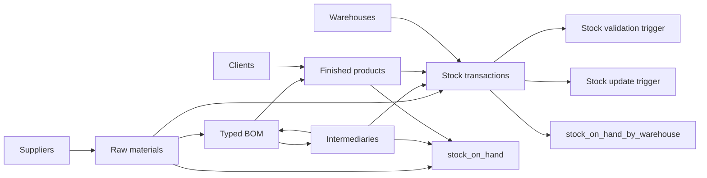
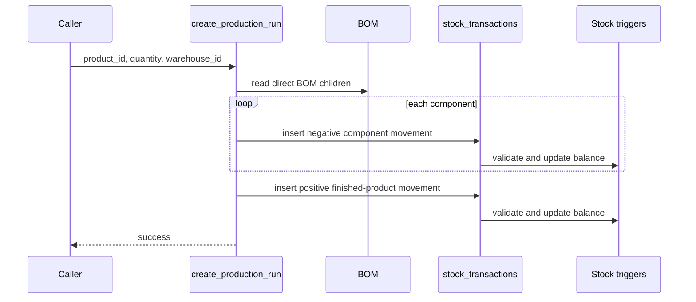

# Architecture

## Data flow

## Inventory tiers

The database uses three physical item tables:

- `raw_materials` for purchased inputs
- `intermediaries` for stocked sub-assemblies
- `finished_products` for sellable output

This is intentionally different from a single generic product table. It keeps
domain-specific relationships explicit, such as suppliers on raw materials and
clients on finished products.

## Typed relationships

### Bill of materials

The `bom` table is polymorphic by design. A row identifies its parent through
`parent_type + parent_id` and its child through `child_type + child_id`.

Allowed parent types are `intermediate` and `finished`. Allowed child types
are `raw` and `intermediate`.

Because PostgreSQL foreign keys cannot directly target different tables based
on a type column, BOM references are validated by
`trg_check_bom_references`.

### Stock transactions

`stock_transactions` uses the same typed-reference idea through
`product_type + product_id`. Every inventory change is represented by a
signed transaction:

- positive quantity: stock enters the system or location
- negative quantity: stock is consumed or leaves a location

The stock trigger layer validates the target item and prevents the global
balance from becoming negative.

## Stock state

The item tables keep a `current_stock` value for fast global reads. It is
updated by `trg_update_current_stock` after each stock transaction.

Warehouse-specific balances are not stored as mutable columns. They are
derived from the transaction ledger by `stock_on_hand_by_warehouse`.

This gives the project two useful representations:

- fast global balance on each item record
- auditable per-warehouse balance derived from transaction history

## Production flow

## Reporting

The main reporting surfaces are:

- `stock_on_hand`: global current stock across all item tiers
- `reorder_alerts`: items below their configured minimum level
- `stock_on_hand_by_warehouse`: ledger-derived location balances
- `bom_explosion(...)`: recursive rolled-up component requirements
